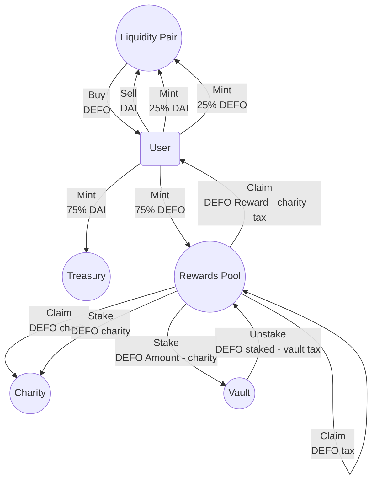

[](https://github.com/defoundationxyz/defo-contract/actions/workflows/test.yml)

# DEFO smart contracts

[DEFO](https://docs.defo.app/) is a DeFi protocol on AVAX.
If you buy a Yield Gem NFT with our DEFO token, you get DEFO
rewards every week.

## Preparation

Copy `.env.example` to `.env`.

```shell
$ yarn install
```

## Testing

To run unit & integration tests:

```shell
$ yarn test
```

To run the coverage:

```shell
$ yarn coverage
```

Note to compile the contracts and build the types with `yarn typechain` prior to that if you're running
coverage as the
first command after installation.

## Deployment

We use [Hardhat](https://hardhat.dev) and [hardhat-deploy](https://github.com/wighawag/hardhat-deploy).
In one terminal window build the contracts, spin-up a HardHat EVM forking the Avalanche mainnet, and deploy the
contracts to it:

```shell
yarn start-fork
```

Deployment (or upgrading) the contracts are done with

```shell
yarn deploy NETWORK   #NETWORK is localhost, fuji or mainnet
```

Scripts in [/deploy](./deploy) as well as the handy scripts below work with any network managed by the hardhat and
hardhat-deploy.

## E2E Scenario

While your HardHat EVM is running, in other terminal window permit DAI and DEFO, mint a gem, wait some time to generate
yield, and put the generated yield into the vault with:

```shell
yarn dev
```

## Contracts

The contract is built as an EIP-2535 Diamond, implementing ERC-721 functionality covering Yield Gem
NFTs. DEFO Token is a separate ERC-20 token.

### Avalanche FUJI Addresses

| Contract                                       | Address                                      |
|------------------------------------------------|----------------------------------------------|
| DEFO Token ERC-20                              | [0xA9D3adb2B5c7d89c56d74584E98ABcea1E4e6a4D](https://testnet.snowtrace.io/address/0xA9D3adb2B5c7d89c56d74584E98ABcea1E4e6a4D) |
| DEFO Protocol Main Contract ERC-721 compatible | [0xf0d26dD82f6beE798cB677ee17E5466d009193Eb](https://testnet.snowtrace.io/address/0xf0d26dD82f6beE798cB677ee17E5466d009193Eb) |

DAI for fuji is a customly deployed contract from the real Dai code but mintable by anyone for test purposes.
the address
is [0x3362FE2f7E17A5a9F90DaBE12E4A6E16E146F19a](https://testnet.snowtrace.io/address/0x3362FE2f7E17A5a9F90DaBE12E4A6E16E146F19a)
add it to the injected wallet along with the DEFO Token to test with the DApp.

## Handy Hardhat Tasks

To play around with the smart contracts, there is a bunch of handy scripts.
They cover complete protocol functionality from the command line.
To use them on the local network run `yarn start-fork` in a separate terminal at first.

These tasks reply on `hardhat deploy`, so the deployment to the desired network is necessary to interact with the
contracts from the command line. Technically, the scripts can be redesigned to work with the contract addresses vs
deployments, although the main focus here is the development aid and testing the deployments, but not the user-facing
command line substitution of the Dapp UI.

Most of the scripts require network name. If `NETWORK` is specified, it's mandatory and should be substitued
by `localhost`, `fuji` or `mainnet`.
Also be sure to set `LIVENET_MNEMONIC` in the `.env` file for fuji or mainnet is he account executing the below tasks.

E.g. `yarn accounts fuji` displays contract wallets on fuji.

`--help` shows parameters.

Parameters (including `--help`) should be specified after the network, e.g. `yarn gems fuji --type 1`

### Deployments

Deployments which are the prerequisite to use all the below tasks.

```shell
yarn deployments NETWORK  #display deployments with addresses
```

### Accounts

View function, doesn't change the state.

```shell
yarn accounts NETWORK      # AVAX, DAI, DEFO balances of all the named accounts, and liquidity pair info
```

### Config

View or change configuration function (if authorized).

```shell
yarn conf NETWORK          # view config, if parameters specified changes it if authorized

OPTIONS:

  --maintenance-period  	maintenance period in a human-readable format without spaces: '1w', '1day', '20h', etc.
  --reward-period       	reward period in a human-readable format without spaces: '1w', '1day', '20h', etc.
  --tax-scale-period    	taxScale update since last claim period in a human-readable format without spaces: '1w', '1day', '20h', etc.
  --vault-withdrawal-tax	vault withdrawal tax rate multiplied by 100, e.g. 1000 for 10%
  --wallets             	set all protocol wallets, note, all 6 should be provided comma separated with no spaces, e.g. 0x001,0x002,0x003,0x004,0x005,0x006
```

### Liquidity

Without params provides info on the configured DEX liquidity pair, if parameters are specified funds the pair from the
default wallet which
is  `LIVENET_MNEMONIC` in the `.env` file, or `deployer` for localhost:

```shell
yarn liquidity NETWORK  # funds DAI-DEFO liquidity pair

OPTIONS:

  --dai 	DAI to add to the pool
  --defo	DEFO to add to the pool

```

### Gems

View function, doesn't change the state. Basically the most important view function providing core protocol gems state
information and user information.

```shell
yarn gems NETWORK          # gems configuration, and balances of the NFTs for the deployer

OPTIONS:
  --type	0 - sapphire, 1 - ruby, 2 - diamond, empty (-1) - get info for all three (default: -1)
```

### Test funding with ERC-20 DEFO and DAI

Obviously doesn't work for the mainnet. Suitable for `localhost` and `fuji` only.

```shell
yarn get-some-dai NETWORK   # optional with account and amount, e.g. --account all --amount 10000
yarn get-some-defo NETWORK  # mints DEFO ERC20 token, optional with account and amount, e.g. --account all --amount 10000

OPTIONS FOR BOTH COMMANDS:

  --account	The account name to get DAI, e.g. 'treasury', 'vault', or 'all' (default: "deployer")
  --amount 	The amount to transfer to the deployer (default: 100000)
```

### Permit

```shell
yarn permit NETWORK #Permits spending DAI and DEFO on behalf of the contract.
```

### Mint Gems

Don't forget to get DAI, DEFO, and give `permit` before minting.

```shell
yarn get-some-gems NETWORK  # mints all 3 gems, optional with gem type (0,1,2), e.g. --type 0

OPTIONS:

  --amount	number of gems to be minted (default: 1)
  --type  	0 - sapphire, 1 - ruby, 2 - diamond, empty (-1) - mint all three (default: -1)
```

### Claim

Claim the earned reward in DEFO to the wallet.

```shell
yarn claim NETWORK          # claim all claimable gems rewards, optional with gem id --id

OPTIONS:

  --id  	gem id to claim rewards for a specific gemId (default: -1)
  --type	claim for all gems of given type 0 - sapphire, 1 - ruby, 2 - diamond, all gems if empty (default: -1)
```

### Vault

Views vault state if no params, or stakes/unstakes.

```shell
yarn vault NETWORK          # showing vault stats without changes, puts to vault with params --id --amount

OPTIONS:

  --amount	amount of pending unclaimed rewards to stake or the amount currently in the vault to unstake
  --id    	gem id to stake or unstake
  --op    	operation: 'view', 'stake' or 'unstake' (default: "view")
```

### Jump in Time

This works only for testing on `localhost` hardhat network, just gives an opportunity to move back and forth in time to
check reward generation, maintenance fee accrual, and other time-dependand functionality.

```shell
yarn jump-in-time   # optional with human-readable time without spaces, e.g. --time 7d
```

Check out [package.json](./package.json) and [./tasks](./tasks) for more.

## Cash flow



## Links

- Checkout DeFo website: [https://defo.app/](https://defo.app/)
- Pretty detailed whitepaper: [https://defo.app/whitepaper.pdf](https://defo.app/whitepaper.pdf)
- Feel free to join [Discord](discord.gg/defo).
