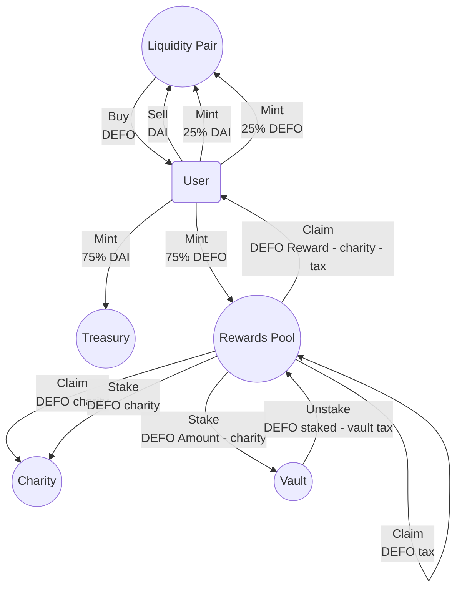

[](https://github.com/defoundationxyz/defo-contract/actions/workflows/test.yml)

# DEFO smart contracts

[DEFO](https://docs.defo.app/) is a DeFi protocol on AVAX.
If you buy a Yield Gem NFT with our DEFO token, you get DEFO
rewards every week.

## Preparation

Copy `.env.example` to `.env`.

```shell
$ yarn install
```

## Testing

To run unit & integration tests:

```shell
$ yarn test
```

To run the coverage:

```shell
$ yarn coverage
```

Not to compile the contracts and build the smart contract types with `yarn typechain` prior to that if you're running
coverage as the
first command after installation.

## Deployment

We use [Hardhat](https://hardhat.dev) and [hardhat-deploy](https://github.com/wighawag/hardhat-deploy).
In one terminal window build the contracts, spin-up a HardHat EVM forking the Avalanche mainnet, and deploy the
contracts to it:

```shell
yarn start-fork
```

Deployment to a live network is done with the

```shell
yarn deploy #network, e.g. fuji or mainnet
```

Scripts in [/deploy](./deploy) as well as the handy scripts below work with any network managed by the hardhat and
hardhat-deploy.

## E2E Scenario

While your HardHat EVM is running, in other terminal window permit DAI/DEFO, mint a gem, wait some time to generate
yield, and put the generated yield into the vault with:

```shell
yarn dev
```

## Handy scripts

To play around with the smart contracts, there is a bunch of handy scripts.
Get a local mainnet fork running with the contracts deployed with `yarn start-fork`.

Try those in a separate terminal:

```shell
yarn accounts       # AVAX, DAI, DEFO balances of all the named accounts
yarn gems           # balances of the NFTs for the deployer
yarn dev:get-some-dai   # optional with account and amount, e.g. --account all --amount 10000
yarn get-some-defo  # mints DEFO ERC20 token
yarn get-some-gems  # mints all 3 gems, optional with gem type (0,1,2), e.g. --type 0
yarn jump-in-time   # optional with human-readable time without spaces, e.g. --time 7d
yarn claim          # claim all claimable gems rewards, optional with gem id --id
yarn vault          # showing vault stats without changes, puts to vault with params --id --amount
yarn add-liquidity  # funds DAI-DEFO liquidity pair
```

Check out [package.json](./package.json) and [./tasks](./tasks) for more.

## Contracts

The contract is built as an EIP-2535 Diamond, implementing ERC-1155 functionality covering both DEFO Token and Yield Gem
NFTs.
In order to interact with the deployed contracts, see [contracts/interfaces](./contracts/interfaces).

### Avalanche FUJI Addresses

| Contract                                       | Address                                      |
|------------------------------------------------|----------------------------------------------|
| DEFO Token ERC-20                              | [0xA9D3adb2B5c7d89c56d74584E98ABcea1E4e6a4D](https://testnet.snowtrace.io/address/0xA9D3adb2B5c7d89c56d74584E98ABcea1E4e6a4D) |
| DEFO Protocol Main Contract ERC-721 compatible | [0xf0d26dD82f6beE798cB677ee17E5466d009193Eb](https://testnet.snowtrace.io/address/0xf0d26dD82f6beE798cB677ee17E5466d009193Eb) |

## Cash flow



## Fuji testnet deployments

DAI - 0x3362FE2f7E17A5a9F90DaBE12E4A6E16E146F19a
DEFO - 0xD44C8E9ACD1532f8B4487477176b2ad2E4b0c355
Diamond - 0xf281929CAb1B0d9550b3F96Cd1B14722E68CA7BB
