# DEFO smart contracts

DEFO is a DeFi protocol on AVAX. If you buy a Yield Gem NFT with our DEFO token, you get DEFO rewards every week.

## Preparation

Copy `.env-example` to `.env`.

```sh
$ yarn install
```

## Testing

To run unit & integration tests:

```sh
$ yarn test
```

To run coverage:

```sh
$ yarn coverage
```

## Deployment

We use [Hardhat](https://hardhat.dev) and [hardhat-deploy](https://github.com/wighawag/hardhat-deploy).
In one terminal window build the contracts, start a HH EVM fork of Avalanche mainnet, and deploy with:

```shell
yarn start-fork
```

In the other terminal window run the permit, mint, and wait a year script

```shell
yarn dev
```

## Handy scripts

To use those you need to have a local network running and contracts deployed, e.g. with `yarn start-fork`

```shell
yarn accounts       # AVAX, DAI, DEFO balances of all the named accounts
yarn gems           # balances of the NFTs for the deployer
yarn get-some-dai   # optional with account and amount, e.g. --account all --amount 10000
yarn get-some-defo  # same
yarn get-some-gems  # mints all 3 gems, optional with gem type (0,1,2), e.g. --type 0
yarn jump-in-time   # optional with human-readable time without spaces, e.g. --time 7d
yarn claim          # claim all claimable gems rewards, optional with gem id --id
yarn vault          # showing vault stats without changes, puts to vault with params --id --amount
```

## Contracts diagram

```mermaid
classDiagram
%% + public, + external, -internal, #private, ~modifier
%% * view, $ storage

class GemFacet {
  +getTaxTier(tokenId)
  +wenNextTaxTier(timeFromLastRewardWithdrawal)
  +RedeemMint(type, to) ~onlyMinter()
  +RedeemMintBooster(type, booster, to) ~onlyMinter()
  +BoostGem(booster, tokenId) ~onlyGemOwner() ~onlyActive()
  +getBoosters(booster, tokenId) (int,int)
  +MintGem(type) ~SaleLock ~mintLimit(type)
  +ClaimRewards(_tokenId) ~onlyClaimable ~onlyGemOwner()
  +Maintenance(_tokenId, _time) ~onlyGemOwner()
  +BatchMaintenance(_tokenIds[])
  +BatchClaimRewards(_tokenIds[])
  +BatchClaimRewards(_tokenIds[])
  +Compound(tokenId, gemType) ~onlyGemOwner() ~onlyActive()
  +Compound(tokenId, gemType) ~onlyGemOwner() ~onlyActive()
  +isActive(tokenId)* bool
  +isClaimable(tokenId)* bool
  +checkRawReward(tokenId)* uint
  +checkTaperedReward(tokenId)* uint
  +checkTaxedReward(tokenId)* uint
  +checkPendingMaintenance(tokenId)* uint
  +getGemIdsOf(tokenId)* uint[]
  +getGemIdsOfWithType(user, tokenId)* uint[]
  +getUserRewardEarned(user, tokenId)* uint[]
  +getTotalRewardEarned(user, tokenId)* uint[]
  -_distributePayment(amount, isDefo)
  -_mintGem(type, to) uint
  -_sendRewardTokens(tokenId, offset) uint
  -_compound(tokenId, gemType) uint ~mintLimit(gemType)
  -_maintenance(tokenId, time)
}
GemFacet --> LibMeta: uses
GemFacet --> LibUser: uses
GemFacet --> LibGem: uses
GemFacet --> LibERC721Enumerable: uses


class GemGettersFacet {
  +GemOf(tokenId) LibGem.Gem
  +GetGemTypeMetadata(type) LibGem.GemTypeMetadata
  +getUserTotalCharity(user) uint
  +getMeta() LibMeta.DiamondStorage
  +getTotalCharity() uint
  +getExpiredTimeSinceLock(gemType) uint
  +isMintAvailableForGem(gemType) bool
  +getAvailableBoosters(booster, type, user) uint
}
GemGettersFacet --> LibGem: uses
GemGettersFacet --> LibMeta: uses
GemGettersFacet --> LibUser: uses

class OwnerFacet {
  +initialize(_redeemContract, _defoToken, _paymentToken, _treasury, _limiter, _rewardPool, _donation) ~onlyOnwer()
  +setGemSettings(type, gemData) ~onlyOwner()
  +setAddressAndDistTeam(newAddress, daiRate, DefoRate) ~onlyOwner()
  +setOther~Params~
}
OwnerFacet --> LibGem: uses
OwnerFacet --> LibMeta: uses
OwnerFacet --> LibERC721: uses

class VaultStakingFacet {
  +batchAddToVault(tokenIds, amounts)
  +addToVault(tokenId, amount)
  +showStakedAmount() uint
  +showTotalAmount() uint
  +gemVaultAmount(tokenId) uint
  +getAllVaultAmounts(user) uint[]
  +removeAllFromVault(user)
  +removeFromVault(tokenId, amount)
  +removeFromVault(tokenId, amount)
}
VaultStakingFacet --> LibGem: uses
VaultStakingFacet --> LibUser: uses
VaultStakingFacet --> LibMeta: uses
VaultStakingFacet --> LibVaultStaking: uses

class LibVaultStaking {
  -diamondStorage() LibVaultStakingDiamondStorage
}

LibVaultStakingDiamondStorage --|>LibVaultStaking
class LibVaultStakingDiamondStorage {
  StakedFrom uint[uint]
  StakedAmount uint[uint]
  totalAmount uint
}

class LibMeta {
  -msgSender() address
  -getChainID() uint
}
LibMeta --|> LibMetaDiamondStorage
class LibMetaDiamondStorage {
  -MaintenancePeriod uint
  -TreasuryDefoRate uint
  -TreasuryDaiRate uint
  -CharityRate uint
  -RewardPoolDefoRate uint
  -TeamDaiRate uint
  -LiquidityDefoRate uint
  -LiquidityDaiRate uint
  -_tokenIdCounter Counters.Counter
  -PaymentToken IERC20Joe
  -DefoToken IERC20Joe
  -RewardTaxTable uint[]
  -MinReward uint
  -RewardTime uint
  -MintLimitPeriod
  -Treasury address
  -RewardPool address
  -LimiterAddr address
  -Team address
  -Donation address
  -Vault address
  -Liquidity address
  -MaxGems uint
  -Lock bool
  -transferLock bool
  -TotalCharity uint
}

class LibGem {
  -_taperedReward(tokenId) uint
  -_checkRawReward(tokenId) uint
  -_getTaxTier(tokenId) uint
  -_rewardTax(tokenId) uint
  -_isActive(tokenId) bool
  -_getMaintenanceFee(tokenId) uint
  -_isClaimable(tokenId) bool
  -diamondStorage() LibGemDiamondStorage
}
LibGem --|> LibGemDiamondStorage
class LibGemDiamondStorage {
  +GemOf[tokenId] Gem
  +GemTypeMetadata[gemType] GemTypeMetadata
  +MinterAddr address
  +taperRate uint
}


LibGemDiamondStorage "1" --o "*" Gem : contains
class Gem {
  +MintTime uint
  +LastReward uint
  +LastMaintained uint
  +GemType uint
  +TaperCount uint
  +claimedReward uint
  +stakedReward uint
  +unclaimedRewardBalance uint
  +taperedRewardRate uint
  +booster Booster
}

LibGemDiamondStorage "1" --o "n" GemTypeMetadata : contains
class GemTypeMetadata {
  +LastMint uint
  +MaintenanceFee uint
  +RewardRate uint
  +DailyLimit uint
  +MintCount uint
  +DefoPrice uint
  +StablePrice uint
  +TaperRewardsThreshold uint
  +maintenancePeriod uint
}

class LibERC721 {
  -msgSender() address
  -checkOnERC721Received(operator, from, to, tokenId, data)
  -_balanceOf(owner) uint
  -_ownerOf(tokenId) address
  -_getApproved(tokenId) address
  -_isApprovedForAll(owner, operator) bool
  -_safeMint(to, tokenId)
  -_safeMint(to, tokenId, _data)
  -_exists(tokenId) bool
  -_isApprovedOrOwner(speder, tokenId) bool
  -_mint(to, tokenId)
  -_burn(tokenId)
  -_transfer(from, to, tokenId)
  -_setApprovalForAll(owner, operator, approved)
  -_beforeTokenTransfer(from, to, tokenId)
  -diamondStorage(): LibERC721DiamondStorage
}
LibERC721 --|> LibERC721DiamondStorage: contains
LibERC721 --> LibERC721Enumerable: uses
class LibERC721DiamondStorage {
  -name string
  -_symbol string
  -_owners address[uint]
  -_balances uint[address]
  -_tokenApprovals address[uint]
  -_operatorApprovals bool[address[address]]
  -baseURI string
  -Limiter address
  -init bool
}

class LibUser {
  -diamondStorage() LibUserDiamondStorage
}
LibUser--|>LibUserDiamondStorage

class LibUserDiamondStorage {
  -users address[]
  -GetUserData UserData[address]
}

LibUserDiamondStorage "1" --o "*" UserData: contains
class UserData {
  -OmegaClaims uint[uint]
  -DeltaClaims uint[uint]
  -charityContribution uint
  -blacklisted bool
}

class LibGem {
  -_taperedReward(tokenId) uint
  -_checkRawReward(tokenId) uint
  -_getTaxTier(tokenId) uint
  -_rewardTax(tokenId) uint
  -_isActive(tokenId) bool
  -_getMaintenanceFee(tokenId) uint
  -_isClaimable(tokenId) bool
  -diamondStorage() LibGemDiamondStorage
}
LibGem --|> LibGemDiamondStorage
class LibGemDiamondStorage {
  +GemOf[tokenId] Gem
  +GemTypeMetadata[gemType] GemTypeMetadata
  +MinterAddr address
  +taperRate uint
}



GemFacet --* DEFODiamond
ERC721Facet --* DEFODiamond
ERC721EnumerableFacet --* DEFODiamond
VaultStakingFacet --* DEFODiamond
GemGettersFacet --* DEFODiamond
OwnerFacet --* DEFODiamond
NodeLimiterFacet --* DEFODiamond
```

